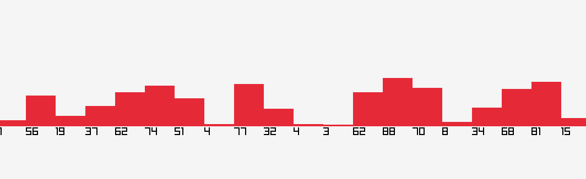

# VisualSort

---

## About

VisualSort is a C++ application built using the Raylib and Raygui libraries.
It allows users to visualize how sorting algorithms work in a simple and effective way!

---

## Why did I create this project?

I'm a high school student, and this year we started learning C++. During our lessons, we also started studying sorting algorithms and I immediately got interested in it!

I noticed that almost all of my classmates had trouble understanding how they worked. However, as soon as I showed them how the algorithm worked through visual representation, they seemed to understand them much more easily!
For this reason, I decided to learn more about sorting algorithms and create this project to help people visualize them and understand them more quickly and I can even end up learning more about these algorithms!

---

## Features

1. [x] Shuffle the values
2. [x] Start the sorting process
3. [x] Choose the number of values to display (up to 100)
4. [ ] Compare two algorithms
5. [X] Change the sorting speed
6. [ ] Display a short description of the selected algorithm
7. [X] Display statistics of the used algorithm
8. [ ] Add more sorting algorithms

### WIP: As of now, these are the algorithms implemented:
- Bubble Sort
- Selection Sort
- Insertion Sort

--- 

## How to run

WIP
