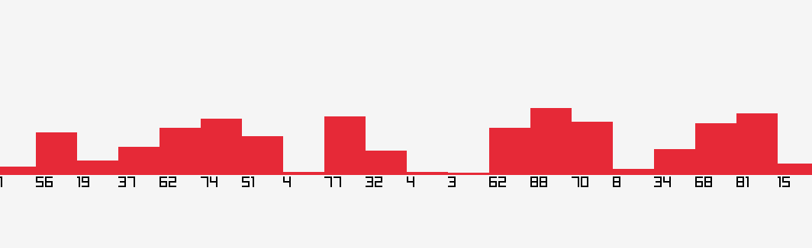
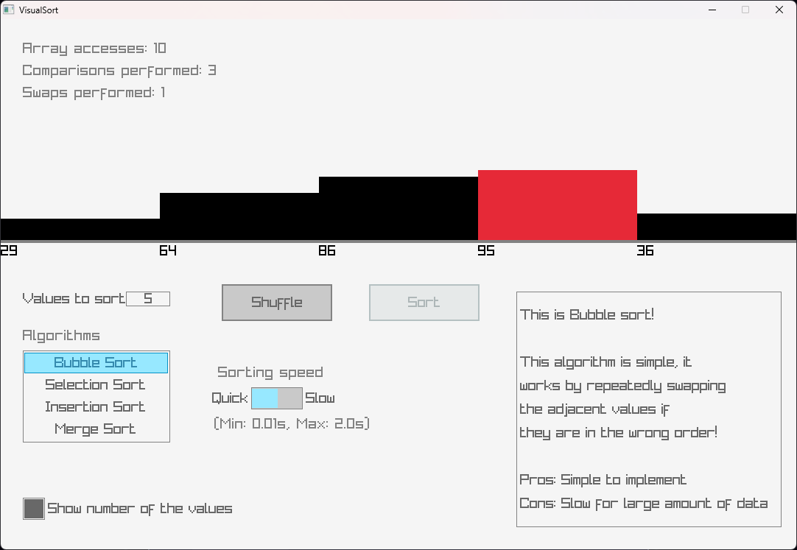
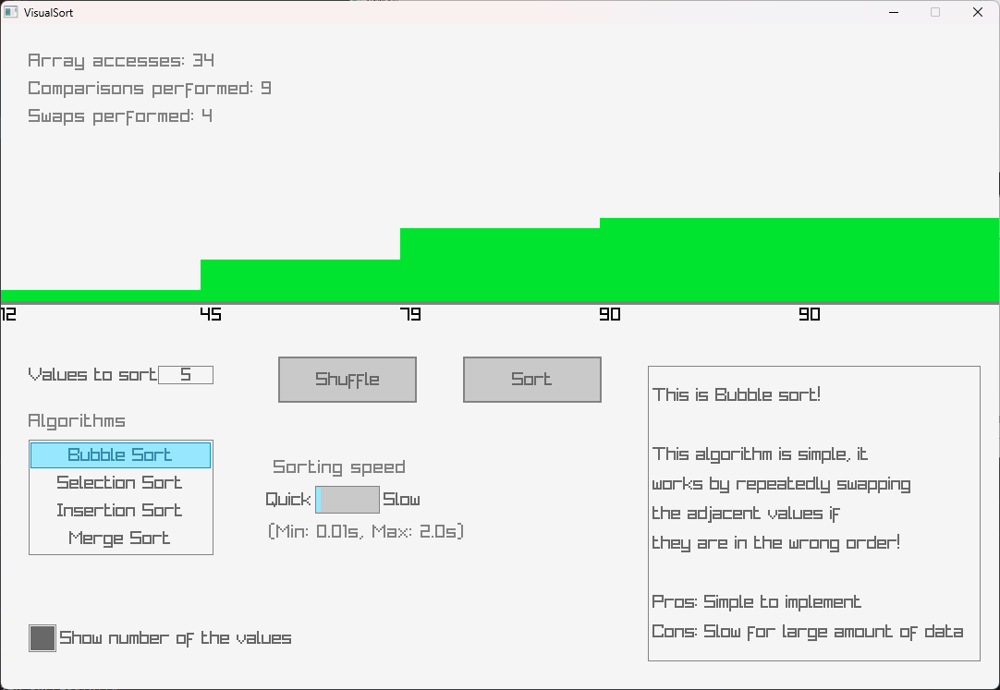

# VisualSort

---



## About

VisualSort is a C++ application built using the Raylib and Raygui libraries.
It allows users to visualize how sorting algorithms work in a simple and effective way!

---
## Why did I create this project?

I'm a high school student, and this year we started learning C++. During our lessons, we also started studying sorting algorithms and I immediately got interested in it!

I noticed that almost all of my classmates had trouble understanding how they worked. However, as soon as I showed them how the algorithm worked through visual representation, they seemed to understand them more easily!
So, I decided to learn more about sorting algorithms and create this project to help people visualize them and understand them more quickly and I can even end up learning more about these algorithms!

---
## Features

1. [x] Shuffle the values
2. [x] Start the sorting process
3. [x] Choose the number of values to display (up to 100)
4. [X] Change the sorting speed
5. [X] Display a short description of the selected algorithm
6. [X] Display statistics of the used algorithm
7. [X] Add more sorting algorithms

### As of now, these are the algorithms implemented:
- Bubble Sort
- Selection Sort
- Insertion Sort
- Merge Sort

---
## Screenshots





---
## Platforms


| Platforms | Availability  |
|----------:|---------------|
|   Windows | Available     |
|     Linux | Not Available |
|     MacOS | Not Available |

## Compiling

### Requirements
- C++ Compiler (GCC/Clang)
- CMake 3.20 or newer
- Git

### Clone the repository

```
git clone https://github.com/fireslash88/VisualSort.git
cd VisualSort
```

### Create a build directory
```
mkdir build
cd build
```

### Generate the build files
```
cmake ..
```

### Compile the software
**IMPORTANT!**

To compile a debug build, use this command. But by doing so, the program will start and open raylib's debug window.
```
cmake --build . 
```
Use this command to compile a release build without having the raylib's debug window!
```
cmake --build . --config Release
```
After doing so, if you go inside the VisualSort folder, you'll see a "bin" folder with inside a folder for the Debug program and then another one for the Release program.
The compiler generates the folder automatically while compiling so **don't worry if you don't see both.** 

It generates the folder associated to the build type you chose!

---
## AI Notice

My idea was to create a project to learn things by myself and trying to do it without using AI.

But unfortunately I had to use it in some parts to help me out for some things that I really didn't know how to fix.

The fixes I made using AI are commented in the code with //AI: as a prefix.

## Support!   
This project was made using two libraries as a base, the **raylib library** and the **raygui library**! 
You should absolutely check them out and also all the other libraries made by raysan8!

This project was also made for the Stardance challenge, organized by Hack Club!